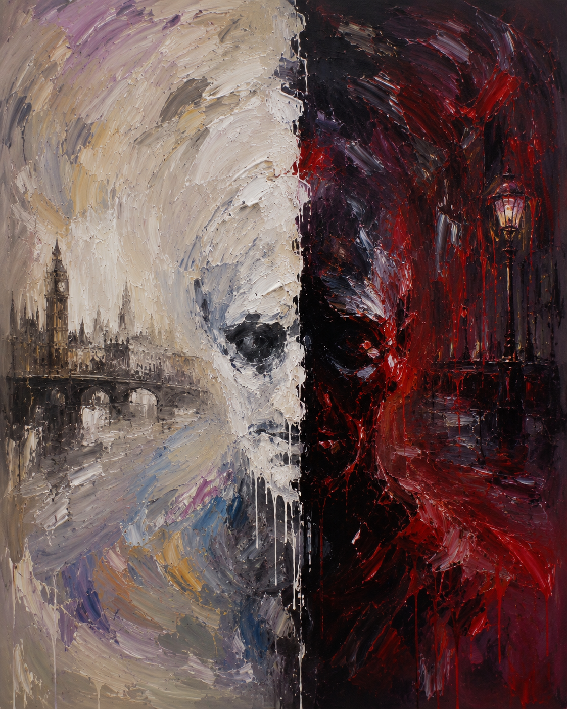

# Jekyll and Hyde

The musical *Jekyll and Hyde* tells the story of Henry Jekyll, a renowned physician in London, England, who attempts an experiment to separate the good and evil aspects of human nature in order to help his father suffering from schizophrenia. However, due to the side effects of the drug he injects into himself, he faces another personality, Edward Hyde. The number [*Confrontation*](https://youtu.be/qWW4E4aCsAA?si=k8Z83CBtB43maxI9), composed by Frank Wildhorn (1958–), appears in the latter part of the show when Jekyll can no longer control Hyde. As Hyde ruins Jekyll's life through repeated murder and violence, Jekyll tries to eliminate him but fails. Ultimately, the two personalities internally clash within the laboratory to dominate one another, and Confrontation musically expresses this internal conflict and the rapid alternation between the two identities.

The portrayal of *Jekyll and Hyde* in the musical is related to Dissociative Identity Disorder, which is characterized by the presence of two or more distinct personalities, with one identity controlling behavior at a time. However, the musical depicts this split personality in an extreme way—showing two identities completely separated into good and evil clashing with each other, and portraying the other personality as being created by a drug. In reality, it is necessary to distinguish this from the actual disorder, as specific identities do not manifest as absolute evil that pursues murder and violence, and the condition is primarily associated with psychological factors such as severe traumatic experiences. From the perspective of medical humanities and narrative medicine, mental illness should be understood not merely as a collection of diagnostic labels and symptoms, but in relation to the suffering and life experiences of the individual. Therefore, *Jekyll and Hyde* can be understood not as a literal depiction of dissociative identity disorder, but as an illness narrative that dramatizes how a person experiences inner conflict and uncontrollable impulses.

In the performance, the actor alters facial expressions and vocal styles according to changes in lighting, visually representing the coexistence of different identities within one person. In Jekyll’s parts under bright lighting, relatively stable and lyrical melodies and vocals express his original self. In contrast, Hyde’s parts under dark lighting emphasize an aggressive and uncontrollable personality through rough vocalization. In addition, the contrasting lyrics, such as Hyde’s statement “You will never get away from me.” and Jekyll’s denial “All that you are Is a face in the mirror,” symbolically depict the conflict between the two identities. As the song progresses toward the end, the tempo and orchestral tension intensify, while the exchanges between the two personalities become increasingly brief, almost line by line, making their conflict appear more intense. The contrasting musical characteristics of Jekyll and Hyde do more than simply distinguish the two personalities. Rather, they musically reveal an inner division that cannot be reduced to a single unified self.

These abrupt shifts and unstable musical structures do more than simply convey confusion; they also resonate with disability aesthetics, which embraces fracture and imperfection as forms of aesthetic expression rather than judging harmony and stability as the only ideals of beauty. In this sense, the song can also be interpreted through Edward Said’s idea of “resistance to harmony,” as it challenges conventional assumptions that unity and coherence are the highest aesthetic values. Furthermore, Adorno argued that late Beethoven’s works reveal traces of rupture, discontinuity, and dissonance rather than harmonious unity. Likewise, Confrontation never fully reconciles the voices of Jekyll and Hyde, allowing their conflict to persist instead of resolving into a single order. In this sense, the work can be connected to Adorno’s aesthetics of negativity.
Thus, *Confrontation* highlights division and instability as central musical devices that reveal the complexity of the human psyche. Through these musical elements, the song translates otherwise inexpressible confusion and suffering into sound, allowing audiences to experience the character’s inner turmoil indirectly. However, the suffering presented in the work should be understood as an aesthetically reconstructed and stylized representation, rather than the suffering experienced by actual patients.

In *Confrontation*, the audience experiences the conflict between Jekyll and Hyde and the gradual collapse of a unified self through music. However, what the audience comes to understand is not the entirety of the lived experience of a person with DID, but rather a narrative of illness reconstructed by the playwright and composer. This suggests that art represents a patient’s experience within a particular form, rather than conveying it exactly as it is. While the musical invites empathy for the character’s inner turmoil, it cannot fully convey the experience itself. Instead, this limitation prompts us to reconsider what it truly means to understand another person’s suffering. Therefore, what matters is not the confidence that we have fully understood a patient’s experience, but the willingness to recognize the limits of our understanding and to continue listening to the patient’s story. In this sense, *Confrontation* provides an opportunity to reflect on how healthcare professionals should listen to and engage with patients’ illness narratives.

In this regard, it would be helpful to refer to [the analysis of *Kill Me, Heal Me*](lee-gaeun.md), another work that expresses the split personality of a protagonist with the same disorder through the intersection of lyrics and voice. Additionally, referring to [the analysis of *Black Swan*](eo-daekyoung.md), which illustrates a character's deteriorating mental state through musical elements, would also be beneficial.

# 지킬 앤 하이드

뮤지컬 《지킬 앤 하이드》는 영국 런던의 저명한 의사 헨리 지킬이 조현병을 앓는 아버지를 위해 인간의 본성을 선과 악으로 분리하는 실험을 감행하다, 스스로에게 투여한 약물의 부작용으로 또 다른 인격체인 에드워드 하이드를 마주하며 겪는 이야기다. 프랭크 와일드혼 (Frank Wildhorn, 1958~)이 작곡한 넘버 [《대결(Confrontation)》](https://youtu.be/qWW4E4aCsAA?si=k8Z83CBtB43maxI9)은 극의 후반부인 지킬이 더 이상 하이드를 통제하지 못하게 되는 시점에 등장한다. 하이드는 살인과 폭력을 반복하며 지킬의 삶을 무너뜨리고, 지킬은 그를 없애려 하지만 실패한다. 결국 두 인격은 실험실 안에서 서로를 지배하기 위해 내적으로 충돌하게 되는데, 《대결》은 이러한 내적 갈등과 두 인격 간의 급격한 전환을 음악적으로 표현한다.

극 속 지킬과 하이드의 모습은 둘 이상의 서로 다른 성격이 존재하며 한 번에 하나의 성격이 행동을 지배하는 해리성 정체감 장애와 관련이 있다. 다만 극에서는 선과 악이 완전히 분리된 두 인격이 극단적으로 대립하는 방식으로 자아 분열을 묘사하고 약물에 의해 또 다른 인격이 만들어지는 것처럼 표현된다. 실제로는 특정 인격이 살인과 폭력을 추구하는 절대적인 악으로 나타나는 질환이 아니며, 주로 심각한 외상 경험과 같은 심리적 요인과 관련되어 발생한다는 점을 구별해 이해할 필요가 있다. 나아가 의료인문학과 서사의학의 관점에서 볼 때, 정신질환은 단순히 진단명이나 증상의 목록으로 환원되기보다 개인이 경험하는 고통과 삶의 맥락 속에서 이해될 필요가 있다. 따라서 《지킬 앤 하이드》를 실제 해리성 정체감 장애의 재현으로 받아들이기보다는, 한 인간이 자신의 내면적 갈등과 통제 불가능한 충동을 어떻게 경험하는지를 극적으로 형상화한 질환서사로 이해할 수 있다.

작품 속 배우는 조명의 변화에 맞춰 표정과 발성을 달리하며 두 인격체를 번갈아 연기함으로써 한 사람 안에 서로 다른 자아가 공존하는 모습을 시각적으로 표현한다. 밝은 조명 속 지킬의 파트에서는 비교적 안정적이고 서정적인 선율과 발성을 사용하여 본래의 자아를 표현하는 반면, 어두운 조명 속 하이드의 파트에서는 거친 발성을 통해 공격적이고 통제되지 않는 인격을 강조한다. 또한 ‘넌 나를 못 벗어나, 절대’라고 지배하려는 하이드와 ‘천만에, 넌 단지 거울 속 허상’ 라고 부정하는 지킬의 가사 대립을 통해 자아가 충돌하는 모습을 상징적으로 보여준다. 곡의 후반부로 가면 템포와 오케스트라의 긴장감이 고조되고, 두 인격이 한 줄씩 짧게 주고받는 형태로 변화하면서 자아 간 충돌은 더욱 격렬하게 드러난다. 지킬과 하이드의 상반된 음악적 성격은 단순히 두 인격을 구분하기 위한 장치에 그치지 않는다. 오히려 하나의 통일된 자아로 환원될 수 없는 내면의 분열을 음악적으로 드러낸다.

이러한 불안정한 구조와 급격한 전환은 단순히 혼란을 표현하는 데 그치지 않고, 전통적인 조화와 안정성을 이상적인 아름다움으로 간주하는 관점에서 벗어나 균열과 불완전함 자체를 하나의 미적 표현으로 받아들이는 장애미학의 시각과도 연결된다. 또한 전통적으로 조화와 통일성을 이상적인 아름다움으로 간주해 온 관점에 저항한다는 점에서, 에드워드 사이드가 말한 '조화에 대한 저항'과도 연결된다. 더 나아가 아도르노는 후기 베토벤의 작품에서 조화로운 통일성 대신 불화와 단절, 그리고 파열의 흔적이 드러난다고 보았는데, 《대결》 역시 두 목소리가 끝내 하나의 질서 속으로 통합되지 않은 채 충돌을 지속한다는 점에서 이러한 부정성의 미학과 연결될 수 있다. 즉 《대결》은 질서와 통일성보다는 분열과 불안정 자체를 음악적 표현의 핵심 요소로 삼음으로써 인간 내면의 복잡성을 드러낸다. 이러한 음악적 표현은 말로 설명하기 어려운 혼란과 고통을 청각적 언어로 번역함으로써, 관객이 인물의 내면을 간접적으로 경험하도록 만든다. 그러나 작품이 전달하는 것은 실제 환자가 경험하는 고통 그 자체라기보다, 예술적으로 재구성되고 양식화된 고통의 모습이라는 점에서 다시 한 번 구별할 필요가 있다.

《대결》에서 관객은 지킬과 하이드의 충돌, 그리고 하나의 통일된 자아가 붕괴되어 가는 과정을 음악적으로 경험한다. 하지만 관객이 이해하게 되는 것은 실제 해리성 정체감 장애 당사자의 삶 전체라기보다, 극작가와 작곡가에 의해 재구성된 질환서사이다. 이는 예술이 환자의 경험을 있는 그대로 전달하기보다 특정한 형식 안에서 재현한다는 점을 보여준다. 즉 작품은 정신질환의 내면적 혼란에 공감하도록 만들지만, 그 경험 자체를 완전히 전달하지는 못한다. 오히려 이러한 한계는 타인의 고통을 이해한다는 것이 무엇을 의미하는지 다시 질문하게 만든다. 따라서 중요한 것은 환자의 경험을 완전히 이해했다고 확신하는 것이 아니라, 이해의 한계를 인식한 채 환자의 이야기에 지속적으로 귀 기울이는 태도일 것이다. 이러한 점에서 《대결》은 의료인이 환자의 질환서사를 어떻게 경청해야 하는지에 대한 성찰의 계기를 제공한다.

이와 관련하여 가사와 목소리의 교차를 통해 동일한 장애를 가진 주인공의 자아 분열을 표현한 작품인 [《킬미, 힐미(Kill Me, Heal Me)》에 대한 분석](lee-gaeun.md)을 참조하면 도움이 될 것이다. 또한 인물의 망가져 가는 정신 상태를 음악적 요소를 통해 보여주는 [《블랙스완(Black Swan)》에 대한 분석](eo-daekyoung.md)을 참조하면 도움이 될 것이다. 

# The Music I Hope Will Be Played at My Funeral

The music I hope will be played at my funeral is [*Spring Waltz*](https://youtu.be/8Leu1GVRhSo?si=TmfEqphTSkwfnCiN) by Carla Bruni(1967–). I have listened to this song since my college entrance exam days whenever I felt exhausted, and its gentle waltz rhythm and lyrics always brought me comfort and peace. I chose this song hoping that, after I am gone, the people who remember me will find the same comfort rather than remain in sorrow. One line that especially resonates with me is, “Oh, those days are gone, but we can remember.” I hope my funeral will not simply be a time to mourn my death, but a time for people to remember the moments and memories we shared together.

# 나의 장례식에서 연주되길 희망하는 음악

나의 장례식에서 연주되길 희망하는 음악은 카를라 브루니(Carla Bruni, 1967~)의 [《Spring Waltz》](https://youtu.be/8Leu1GVRhSo?si=TmfEqphTSkwfnCiN)이다. 이 노래는 내가 대학 입시를 준비하던 시절부터 지치고 힘들 때마다 들으며 위로를 받았던 곡으로, 잔잔한 왈츠의 리듬과 가사가 늘 마음을 차분하게 만들어 주었다. 내가 떠난 후에도 이 노래를 듣는 사람들이 슬픔에만 머무르기보다, 나처럼 위로와 평안을 느낄 수 있기를 바라는 마음에서 선정했다. 가사 중 'Oh, those days are gone, but we can remember'라는 구절이 있다. 가사처럼, 남겨진 사람들이 단순히 내 삶의 마지막을 애도하기보다 서로 함께했던 시간과 추억을 되새기며 나를 기억하는 자리가 되기를 바란다.
