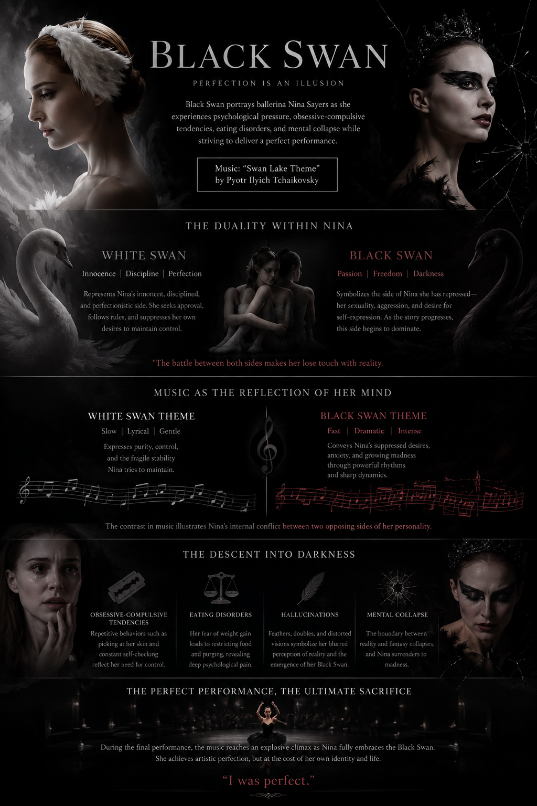

---   
Title: BlackSwan
Year: 2010
Genre: Film
Disease: OCD,EatingDisorder
ICD: F42,F50
---  

https://youtu.be/EqrRVKJcN7I?si=6ib8clSK5ekOr9I7

# BlackSwan

Perfectionistic by nature, Nina constantly pushes herself under the pressure of her overprotective mother and the intense competition of the ballet world. Her repetitive behaviors, such as picking at the skin around her fingernails and repeatedly checking her body, reflect obsessive-compulsive tendencies. Her fear of gaining weight leads her to restrict food intake and engage in purging behaviors, revealing symptoms of an eating disorder. In addition, hallucinations—such as seeing feathers growing from her body and encountering doubles of herself—symbolize her inability to distinguish reality from fantasy and her gradual psychological breakdown. These hallucinations also reflect the increasing dominance of her Black Swan identity, showing how the darker side of her personality gradually overwhelms the controlled and innocent self she once maintained. However, rather than simply defining Nina through diagnostic labels, the film portrays her suffering through her relentless pursuit of perfection, her desire for recognition, and her struggle between conflicting aspects of her identity. In doing so, Black Swan presents her pain not merely as a psychiatric condition, but as a deeply human experience.

In this film, music serves as a crucial element in directly portraying the protagonist’s changing mental state. The Swan Lake theme initially sounds elegant, controlled, and graceful, reflecting Nina’s disciplined and perfectionistic nature. As the story progresses, however, the music becomes faster, louder, and more intense, mirroring her growing anxiety, obsession, and loss of control. The contrast between the lyrical White Swan passages and the dramatic Black Swan sections effectively conveys the conflict between the two sides of Nina’s personality. Particularly during the final performance, when Nina fully embraces the Black Swan, the music reaches an explosive climax. At that moment, the audience witnesses not only her artistic transformation but also her psychological collapse. Through its shifting tempo, dynamics, and emotional intensity, the music communicates feelings of fear, desire, confusion, and inner turmoil that are difficult to express through words alone. As a result, the audience is encouraged to see Nina not simply as a person suffering from mental illness, but as a human being consumed by the overwhelming pursuit of perfection. In the end, Nina whispers, “I was perfect,” after achieving the flawless performance she had always desired, but the cost is her own life. Through music, Black Swan powerfully transforms mental illness from a mere medical diagnosis into a human narrative of suffering, ambition, and identity, allowing the audience to empathize with and better understand her experience.

# 블랙스완

완벽주의적인 성격을 지닌 니나는 어머니의 과도한 통제와 극심한 경쟁 속에서 스스로를 끊임없이 몰아붙인다. 손톱 주변의 피부를 뜯거나 몸을 반복적으로 확인하는 행동은 강박장애적 특성을 보여 주며, 체중 증가에 대한 두려움으로 음식을 거의 먹지 않거나 구토하는 모습은 섭식 장애의 양상을 드러낸다. 또한 몸에서 깃털이 돋아나는 환각이나 자신과 닮은 인물을 보는 장면은 현실과 환상을 구분하지 못하는 정신적 붕괴를 상징한다. 이러한 환각은 흑조로 상징되는 어두운 자아가 점점 강해지면서, 기존의 순수하고 통제된 자아를 압도해 가는 과정을 보여 주기도 한다. 그러나 영화는 니나를 단순히 특정 진단명으로 규정하지 않는다. 오히려 완벽해야 한다는 압박과 인정받고자 하는 욕구, 그리고 상반된 자아 사이의 갈등을 통해 그녀의 고통을 한 인간의 삶과 경험의 차원에서 보여 준다.

이 작품에서 음악은 주인공의 심리적 변화를 직접적으로 드러내는 핵심 요소이다. 「백조의 호수」 테마는 처음에는 우아하고 안정적이며 절제된 분위기로 들려 니나의 규율적이고 완벽주의적인 성격을 반영한다. 그러나 이야기 후반으로 갈수록 음악은 더욱 빠르고 강렬하게 변형되며, 그녀의 불안과 집착, 그리고 통제력의 상실을 드러낸다. 특히 서정적인 백조의 선율과 극적이고 강렬한 흑조의 음악이 대비되면서 니나 안에 존재하는 두 자아의 갈등이 효과적으로 표현된다. 마지막 공연에서 니나가 흑조를 완벽하게 구현하는 장면에서 음악은 폭발적으로 고조되며 절정에 이른다. 이 순간 관객은 그녀의 예술적 변신뿐 아니라 정신적 붕괴 또한 함께 목격하게 된다.

음악은 템포와 강약, 음색의 변화를 통해 언어만으로는 설명하기 어려운 불안, 욕망, 혼란, 두려움을 전달하며 관객이 니나의 내면을 직접 체감하도록 만든다. 그 결과 관객은 니나를 단순한 정신질환자가 아니라 완벽함을 갈망하며 스스로를 소진해 가는 한 인간으로 이해하게 된다. 결국 니나는 “I was perfect.”라는 말을 남기며 자신이 꿈꾸던 완벽한 연기를 이루지만, 그 대가는 자신의 삶이었다. 이처럼 Black Swan은 음악을 통해 정신질환을 단순한 의학적 진단이 아닌 인간의 고통과 서사, 그리고 정체성의 문제로 재구성하며, 관객이 그 경험을 공감하고 이해하도록 만든다.

# 장례식 곡

찰리빈 웍스-우리 사랑은!

이 곡을 선택한 이유는 많은 슬픔과 아픔을 경험했고, 앞으로도 경험할 청춘들에게 큰 위안을 주고 싶기 때문이다.
나는 모든 시련에는 끝이 있으며, 그 끝에는 더 나은 내가 있으리라고 굳게 믿는다. 이 노래를 통해 힘든 시간을 보내고 있는 사람들에게 희망과 용기의 메시지를 남기고 싶다

CHARLIE BEAN WORKS-OUR LOVE IS!
I chose this song because I want to give comfort to young people who have experienced, and will continue to experience, sadness and hardship in their lives.
I firmly believe that every trial has an end, and that at the end of every hardship, I will become a better version of myself. Through this song, I hope to leave a message of hope and encouragement for those who are struggling.

https://www.youtube.com/watch?v=_KTq7UWA9AI&list=RD_KTq7UWA9AI&start_radio=1
