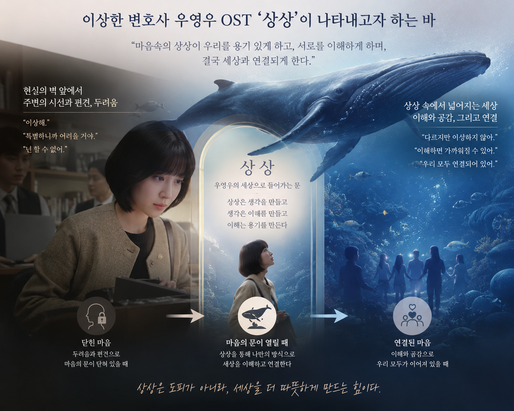

# Extraordinary Attorney Woo

OST 'Imagine' is a song that expresses the inner world of Woo Young-woo, the main character in the drama, The Strange Lawyer. Autism spectrum disorder is characterized by differences in social communication patterns, deep interest and immersion in specific objects, and high sensitivity to sensory stimulation. In the drama, Woo shows a strong interest in whales, connects information in his own way, and understands the world. This song is meaningful in that it views these characteristics in a unique way of cognition, not in deficiency. Although the speaker struggles in reality, it contains a wide and free world of imagination in its mind. The imaginary world becomes a refuge and an order to understand itself, allowing it to endure anxious reality. [One of the most impressive scenes in the drama](https://www.youtube.com/watch?v=5J1B6845VkM) shows Woo Young-woo using his own ability to solve the case even though he has a disability called autism. Music creates a stable atmosphere by using a simple combination centered on piano and string. Repetitive harmonic progression and soft melody remind Woo Young-woo of his regular and orderly way of thinking, and are also linked to the characteristics of autism spectrum disorder, which deeply immerses himself in specific interests. In the drama, this music effectively conveys Woo Young-woo's inner feelings in a scene where he thinks of a whale or solves a problem in his own way. In addition, the stable melody contrasts with the noise and sensory overload of reality and shows the safe inner world she feels. Through this, it arouses warm empathy and understanding in viewers and presents a new perspective on disability. Furthermore, this music is also connected with a critical view of normality and normality. Society defines certain bodies, senses, and ways of thinking as 'normal', but Woo's appearance shows that these standards are not absolute. As confirmed in the history of orthopedics and the discussion of 'right posture', normality is only a norm created by the times and culture and cannot be an absolute criterion for judging human values. Therefore, Woo Young-woo's unique way of thinking can also be understood as another possibility and ability, not as a lack. From the perspective of audacity discussed in the sociology of music in Sui language, music is not necessarily an art experienced only through hearing. Music can be experienced in a variety of ways, including vibration, visual images, body movement, and emotional empathy. Therefore, "Imagination" is not just background music, but functions as a medium of relational communication that allows viewers to experience Woo Young-woo's emotions and thoughts together. This is also connected with the perspective of disability aesthetics, which recognizes the value of various sensory experiences beyond non-disabled centralism that sees disability as a deficiency. Like the content of the class that disease and music have a narrative, this music can be interpreted as a disease narrative that captures the life of a character named Woo Young-woo. Music is a non-verbal narrative that conveys emotions and experiences that are difficult to express in words, and viewers participate as listeners of the narrative. In particular, from the perspective of auditory medical history collection, through this music, we hear the way Woo Young-woo relates to the world and the anxiety and hope he feels in the process rather than the disability itself. Furthermore, as Edward Said and Adorno argued in the discussion of later life styles, art also creates new meanings through resistance and discord to the existing order rather than conforming to the harmony and normality expected by society. Woo Young-woo's unique way of thinking can also be seen as a challenge to social norms, and the drama respects this as a unique way of being, not an object of overcoming. This challenges the view of disability as deficiency and emphasizes the value of diversity. Lastly, like the theme of "Ars longa, art is long", there are limitations in human life and body, but art can go beyond this and convey empathy and understanding to others. "Imagination" shows another way of looking at the world and the imagination, order, and possibility within it, rather than tragically depicting autism spectrum disorder. Therefore, this music can be said to be a work that has a medical and literary meaning that makes us understand human diversity and dignity beyond the view of disability only as an object of overcoming. In this regard, it would be helpful to refer to [the contents of other works](moon-soohyun.md ). I hope that American composer Samuel Barber's Adagio for Strings will be played at my funeral. This music is an arrangement of the second movement of the string quartet No. 2 composed in 1936 for a string orchestra. Today, it is regarded as the most famous memorial song among 20th century classical music. The song begins with a very simple melody, and when the violin quietly sings a single melody, other string instruments support it and gradually expand the range and volume. In particular, music constantly accumulates tension, reaches its peak, and suddenly silent, and then quietly disappears as if it were a person with all his emotions. I hope this music will be played in that it stays with sadness and makes us reflect deeply on human loss and mourning.  [Samuel Barber의 Adagio for Strings](https://www.youtube.com/watch?v=VLR7s8Rq7Dw&list=RDVLR7s8Rq7Dw&start_radio=1)

# 이상한 변호사 우영우

OST ‘상상’은 드라마 이상한 변호사 우영우 속 주인공 우영우의 내면세계를 표현한 곡이다. 자폐 스펙트럼 장애는 사회적 의사소통 방식의 차이, 특정 대상에 대한 깊은 관심과 몰입, 그리고 감각 자극에 대한 높은 민감성 등을 특징으로 한다. 드라마에서 우영우는 고래에 강한 관심을 보이고 자신만의 방식으로 정보를 연결하며 세상을 이해한다. 이 노래는 이러한 특성을 결핍이 아닌 독특한 인지 방식으로 바라본다는 점에서 의미가 있다. 화자는 현실 속에서 어려움을 겪지만 마음속에는 넓고 자유로운 상상의 세계를 품고 있다. 그 상상의 세계는 불안한 현실을 견디게 하는 피난처이자 스스로를 이해하는 질서가 된다. [드라마에서 가장 인상적인 장면 중 하나](https://www.youtube.com/watch?v=5J1B6845VkM)는 우영우가 자폐라는 장애를 가졌음에도 자신만의 능력을 활용해 사건을 해결하는 데 큰 도움을 주고 있는 모습을 보여준다. 음악은 피아노와 스트링 중심의 단순한 편성을 사용하며 안정적인 분위기를 형성한다. 반복적인 화성 진행과 부드러운 선율은 우영우의 규칙적이고 질서 있는 사고방식을 떠올리게 하며, 특정 관심사에 깊이 몰입하는 자폐 스펙트럼 장애의 특성과도 연결된다. 드라마에서 우영우가 고래를 떠올리거나 문제를 자신만의 방식으로 해결하는 장면에서 이 음악은 그녀의 내면을 효과적으로 전달한다. 또한 안정적인 선율은 현실의 소음과 감각적 과부하와 대비되며 그녀가 느끼는 안전한 내면세계를 보여준다. 이를 통해 시청자에게 따뜻한 공감과 이해를 불러일으키며 장애에 대한 새로운 시각을 제시한다. 더 나아가 이 음악은 정상성과 규범성에 대한 비판적 관점과도 연결된다. 사회는 특정한 신체와 감각, 사고방식을 ‘정상’으로 규정하지만, 우영우의 모습은 이러한 기준이 절대적이지 않음을 보여준다. 정형외과학의 역사와 ‘바른 자세’ 논의에서 확인했듯이 정상성은 시대와 문화가 만든 규범일 뿐이며, 인간의 가치를 판단하는 절대적 기준이 될 수 없다. 따라서 우영우의 독특한 사고방식 역시 결핍이 아닌 또 다른 가능성과 능력으로 이해될 수 있다. 수어의 음악사회학에서 논의된 청능주의의 관점에서 보면 음악은 반드시 청각만을 통해 경험되는 예술이 아니다. 음악은 진동, 시각적 이미지, 신체 움직임, 감정적 공감 등 다양한 방식으로 경험될 수 있다. 따라서 「상상」은 단순한 배경음악이 아니라 우영우의 감정과 사고를 시청자가 함께 체험하도록 만드는 관계적 소통의 매개체로 기능한다. 이는 장애를 결핍으로 보는 비장애중심주의를 넘어 다양한 감각 경험의 가치를 인정하는 장애미학의 관점과도 연결된다. 질병과 음악에는 서사가 있다는 수업 내용처럼, 이 음악은 우영우라는 인물의 삶을 담아내는 하나의 질환서사로 해석될 수 있다. 음악은 말로 표현하기 어려운 감정과 경험을 전달하는 비언어적 서사이며, 시청자는 그 서사를 듣는 사람으로 참여한다. 특히 청각적 병력청취의 관점에서 볼 때, 우리는 이 음악을 통해 장애 자체보다도 우영우가 세상과 관계 맺는 방식과 그 과정에서 느끼는 불안, 희망을 듣게 된다. 나아가 말년 양식에 대한 논의에서 에드워드 사이드와 아도르노가 주장했듯이, 예술은 사회가 기대하는 조화와 정상성에 순응하기보다 기존 질서에 대한 저항과 불화를 통해 새로운 의미를 창조하기도 한다. 우영우의 독특한 사고방식 또한 사회 규범에 대한 하나의 도전으로 볼 수 있으며, 드라마는 이를 극복의 대상이 아닌 고유한 존재 방식으로 존중한다. 이는 장애를 결핍으로 바라보는 시각에 도전하며 다양성의 가치를 강조한다. 마지막으로 ‘인생은 짧고 예술은 길다(Ars longa, vita brevis)’라는 주제처럼 인간의 삶과 신체에는 한계가 있지만 예술은 이를 넘어 타인에게 공감과 이해를 전달할 수 있다. 「상상」은 자폐 스펙트럼 장애를 비극적으로 묘사하기보다 세상을 바라보는 또 다른 방식과 그 안의 상상력, 질서, 가능성을 보여준다. 따라서 이 음악은 장애를 극복의 대상으로만 바라보는 시각을 넘어 인간의 다양성과 존엄성을 이해하게 만드는 의료인문학적 의미를 지닌 작품이라고 할 수 있다. 이와 관련해서는 [다른 작품의 내용](moon-soohyun.md)도 참고하면 도움이 될 것이다. 나는 내 장례식에서 미국 작곡가 Samuel Barber의 Adagio for Strings 가 연주되길 희망한다. 이 음악은 1936년에 작곡한 현악 사중주 2번의 2악장을 현악 오케스트라용으로 편곡한 작품이다. 오늘날에는 20세기 클래식 음악 가운데 가장 유명한 추모곡으로 평가받는다. 곡은 매우 단순한 선율로 시작하며 바이올린이 조용히 하나의 선율을 노래하면 다른 현악기들이 이를 받쳐주며 점차 음역과 음량이 확대된다. 특히 음악은 끊임없이 긴장을 축적하다가 절정에 도달한 뒤 갑작스러운 침묵을 맞이하고, 이후 마치 모든 감정을 쏟아낸 사람처럼 조용히 사라진다. 나는 이 음악이 슬픔과 함께 머물며 인간의 상실과 애도를 깊이 성찰하게 만든다는 점에서 이 음악이 연주되길 희망한다. [Samuel Barber의 Adagio for Strings](https://www.youtube.com/watch?v=VLR7s8Rq7Dw&list=RDVLR7s8Rq7Dw&start_radio=1)

