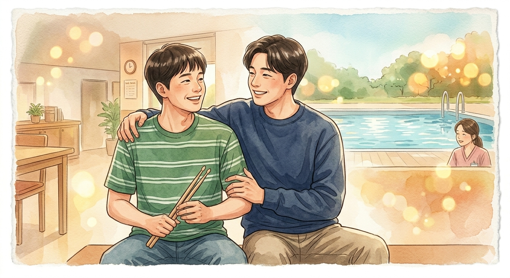

# Inseparable bros

*Inseparable Bros* (2019), Happy, Original by MOCCA, Performed by Shin Ha-kyun, Lee Kwang-soo, and Esom is OST of *Inseparable Bros*. The song features lyrics containing positive messages, such as If you ever get lost, I’m always by your side / Don't give up, hold your head up high. It is notably performed by the lead actors of the film. As the music with the theme of disease mentioned in the 12th week often conveys the inner side of the disease as a metaphor and symbol rather than a direct symptom, To express the purity of Dong-gu, who has an intellectual disability, the soundtrack features bright and upbeat melodies, including bouncing piano notes. This also includes a paradoxical aspect that contrasts with social prejudices or realistic constraints on the disabled. The expression 'Pain is a loudspeaker' in the 5th week is thought of. Furthermore, by incorporating lyrics like "Life that doesn't go well, a heart that always felt unfair / When you're about to fall, cheer up and sing a song," the music conveys an intention to transform the hardships faced by individuals with disabilities into positive energy, rather than simply concealing their struggles. This also shows the difficulties and hopes of people with disabilities at the same time. While watching a movie and listening to this music, it was mentioned in the second week, 'Who determines normality?' The question came to mind. Isn't the appearance of Dong-gu also out of normal due to the standard set by someone? This music appears in the second movie in the work, and it is the middle part of the movie and the ending credits that contain a happy daily life. [Click here to listen to music.](https://youtu.be/l7xjqKNUJmM?si=8d4oWZL5nGgsSuCa)

The music I want to be played at the funeral the most is the national anthem. Because it is music that represents the country I have lived in so far, it is a work that is involved in shaping my identity. Also, I really liked the fact that I expressed my patriotism until I died. 
[Click here to listen to music](https://youtu.be/l7xjqKNUJmM?si=8d4oWZL5nGgsSuCa)
# 나의 특별한 형제

*나의 특별한 형제*의 ost인 신하균, 이광수, 이솜 - happy (원곡 MOCCA)는 만약 길을 잃었을 땐 늘 네 곁에는 내가 있어 포기는 마 고개를 들어 등의 긍정적인 메세지를 함유한 가사가 이어지는 노래이다. 영화에 출연한 배우들이 직접 부른 노래이다. 12주차에서 언급되었던 질병을 주제로 한 음악은 종종 직접적인 증상이 아닌 은유와 상징으로 병의 내면을 전달한다는 것처럼, 이는 지적장애를 가진 동구의 순수함을 표현하기 위해 통통 튀는 느낌을 주는 피아노를 포함하여 밝고 경쾌한 멜로디를 형성했다. 이는 장애인들에 대한 사회적 편견이나 현실적인 제약과 대비되는 역설적인 면모 또한 포함하고 있다. 5주차의 '고통은 확성기다'라는 표현이 떠올려지는 모습이다. 그리고 ‘잘 풀리지 않는 삶 늘 공평하지 않던 맘 넘어지려 할 땐 기운내 노래 불러’ 등의 가사를 사용하며 장애를 가진 이들의 고단함을 숨기기보단 이를 긍정적인 에너지로 승화하려는 의도를 가사에 담고 있다. 이는 장애를 가진 인물들의 어려움과 희망을 동시에 보여주기도 한다. 영화를 보고 이 음악을 들으며 2주차에 언급되었던 '정상성은 누가 정하는가?'라는 질문이 떠올랐다. 동구의 모습 또한 누군가 정한 기준에 의해 정상성 밖으로 벗어나게 된 것이 아닐까? 이 음악은 작중 2번 영화에 등장하는데, 행복한 일상이 담겨진 영화 중반부와 엔딩 크레딧 부분이다. [음악을 들으려면 여기를 클릭](https://youtu.be/l7xjqKNUJmM?si=8d4oWZL5nGgsSuCa)

내가 가장 장례식에 연주되었으면 희망하는 음악은 애국가이다. 내가 지금까지 살아왔던 나라를 대표하는 음악이기에, 나의 정체성을 형성하는데 관여한 작품이기때문이다. 또한 죽을때까지 나의 애국심을 표현한다는 점이 매우 마음에 들었다. [음악을 들으려면 여기를 클릭](https://youtube.com/watch?v=n6WaTObHRJM&si=OKKZ8FVBJ9YSFgqb)
