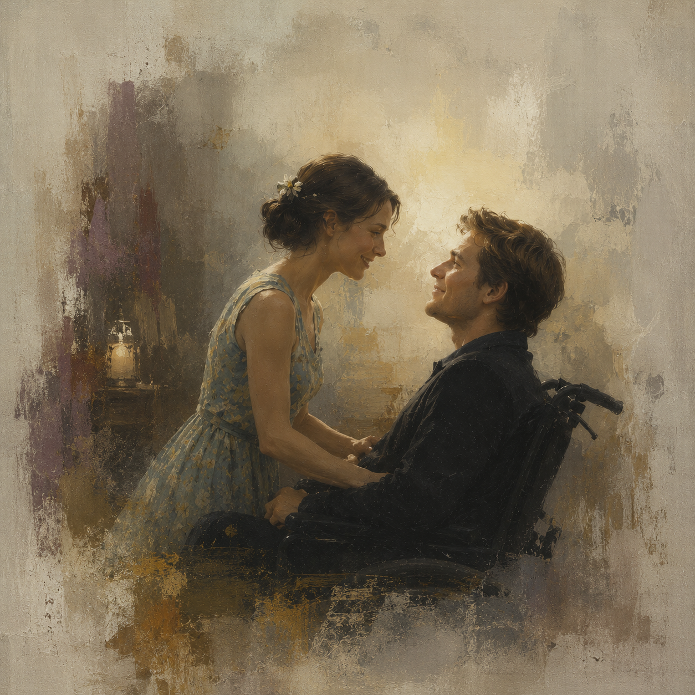

# Me Before You

Me Before You (2016) is a film that delicately explores love, choice, and the limitations of life, while its OST, [Thinking Out Loud](https://youtu.be/Q5z6RHIpi2Y?si=DI2NqKZ7p_K-cqci), further deepens the emotional impact of the story. The song was written by Ed Sheeran and Amy Wadge and conveys a promise of enduring love and growing old together despite the passage of time. It begins with the lyrics, “When your legs don't work like they used to before,” suggesting themes of physical change and disability. In the film, the song serves not merely as background music but as a device that emphasizes the relationships and emotional development of the characters. In particular, it reflects the situation of a character whose way of life has changed due to physical limitations, showing that love is not simply an ideal emotion but something that can be challenged by real-life circumstances and difficult choices. Furthermore, through the music, viewers are able to indirectly understand the life and emotions of a person living with a disability, which can become a process of empathy.

Me Before You does not portray disability as something that simply needs to be overcome. Instead, it presents disability as a reality that transforms a person's entire life. Will’s acquired quadriplegia is not limited to physical inconvenience; it also leads to a loss of self-esteem and despair about the future. Rather than relying on excessive pity or a heroic narrative, the film depicts the isolation experienced by a person with a disability and the weight of deciding how to love someone within realistic circumstances. At the same time, Will’s relationship with Louisa suggests that disability is not the end of life but an opportunity to reconsider life in a different way. The music and subtle direction effectively convey Will’s emotions, encouraging viewers to see disability not as something pitiful but as an issue of human dignity and life itself. However, it is still worth considering whether such appreciation truly leads to understanding and empathy for people with disabilities, or whether it sometimes results in consuming another person’s suffering as an emotional story. In this sense, artistic works that deal with disability and illness are meaningful because they encourage reflection on the boundary between empathy and consumption. For this positive view of disability, it will be helpful to refer to [Contents of Other Movies](oh-hwaeun.md).

I wish [옥상달빛-Happy Ending](https://youtu.be/Ywzq7q66iJ4?si=5vNUcD7YtzPVObNR) would be played at my funeral. The song expresses feelings that the speaker was unable to share honestly with someone important. Throughout the lyrics, the speaker repeatedly promises to always be on the listener’s side and to be there whenever they are struggling. In particular, the final lyric, “Let’s meet again in a brighter place,” can be interpreted as a message to the people who come to my funeral, expressing the hope that we may meet again someday. For this reason, I think it is a song that suits a funeral well. The title, Happy Ending, also reflects my wish for my life to end happily. I believe that people who listen to this song would not simply feel sadness, but would also reflect on the meaning of my life and the feelings I wanted to share with them. Considering both the lyrics and the title as a whole, I chose this song because it contains the exact message I would want to leave for those who attend my funeral.

# 미 비포 유

미 비포 유(2016)는 사랑과 선택, 그리고 삶의 한계를 섬세하게 다룬 작품으로, OST인 [Thinking Out Loud](https://youtu.be/Q5z6RHIpi2Y?si=DI2NqKZ7p_K-cqci)를 통해 감정의 깊이를 더욱 확장한다. 이 곡은 에드시런이 참여해 작곡한 곡으로, 에이미 웨지와 함께 만들어졌으며 시간이 지나도 변하지 않는 사랑과 함께 늙어간다는 약속을 담고 있다. 곡은 "When your legs don't work like they used to before~"로 시작하며 신체적 변화와 장애를 연상시키는 내용을 가사를 통해 전달한다. 영화 속에서 이 노래는 단순한 배경음악이 아니라 인물 간의 관계와 감정 변화를 강조하는 장치로 사용된다. 특히 신체적 제약으로 인해 삶의 방식이 달라진 인물의 상황과 맞물리면서 사랑이 이상적인 감정만이 아니라 현실적 조건 속에서 흔들리고 선택을 요구받는 것임을 보여준다. 또한 관객은 음악을 통해 장애를 경험한 인물의 삶과 감정을 간접적으로 이해하게 되며, 이것이 공감의 과정으로 이어질 수 있다는 점에서 의미가 있다.

영화 Me Before You는 장애를 단순히 극복해야 할 대상으로만 그리지 않고, 한 사람의 삶 전체를 바꾸는 현실로 묘사한다. 윌의 후천적인 사지마비는 신체적 불편함에 그치지 않고, 자존감의 상실과 미래에 대한 절망으로 이어진다. 작품은 이를 과장된 동정이나 영웅적인 서사로 소비하지 않고, 장애를 가진 사람이 느끼는 고립감과 현실적인 조건 속에서 서로를 어떻게 사랑해야 할지에 대한 선택의 무게를 보여준다. 동시에 루이자와의 관계를 통해 장애가 삶의 끝이 아니라 또 다른 방식의 삶을 고민하게 만드는 계기임을 드러낸다. 특히 음악과 잔잔한 연출은 윌의 감정을 섬세하게 전달하며, 관객이 장애를 ‘불쌍함’이 아닌 한 인간의 존엄과 삶의 문제로 바라보게 만든다는 점이 인상적이었다. 또한 이러한 감상이 실제로 장애를 경험한 사람들의 삶을 이해하고 공감하는 과정이 되는지, 혹은 타인의 고통을 감동적인 이야기로만 소비하게 되는지는 계속 고민해 볼 필요가 있다고 생각한다. 이처럼 장애와 질병을 다룬 예술 작품은 공감과 소비의 경계를 성찰하게 한다는 점에서 의미가 있다. 이처럼 장애를 긍정적으로 바라본 관점에 대해서는 [다른 영화의 내용](oh-hwaeun.md)을 참고하면 도움이 될 것이다.

나는 내 장례식장에서 [옥상달빛-Happy Ending](https://youtu.be/Ywzq7q66iJ4?si=5vNUcD7YtzPVObNR)이 연주됐으면 좋겠다. 이 노래의 내용은 화자가 청자에게 그동안 말하지 못한 솔직한 마음을 전하는 내용이다. 가사 속에서 화자는 늘 청자의 편이며, 청자가 힘들 때면 언제나 찾아가겠다고 반복해서 이야기한다. 특히 노래의 마지막 가사인 '더 빛나는 곳에서 우리 다시 만나자'가 장례식장에 와준 사람들과 언젠가 다시 만나자는 의미로 해석될 수 있겠다고 생각해 장례식과 잘 어울리는 노래라고 생각했다. 또 노래의 제목인 Happy Ending처럼 내 삶이 해피엔딩이었으면 좋겠다는 의미도 있다. 이 노래를 듣는 사람들은 단순히 슬픔을 느끼는 것을 넘어, 내가 전하고 싶었던 마음과 삶의 의미를 되새길 수 있을 것이라고 생각한다. 이렇게 노래의 가사와 제목을 전체적으로 봤을 때 내가 내 장례식장에 와준 사람들에게 해주고 싶은 말이 고스란히 담겨 있는 노래라고 생각해서 선택했다.
